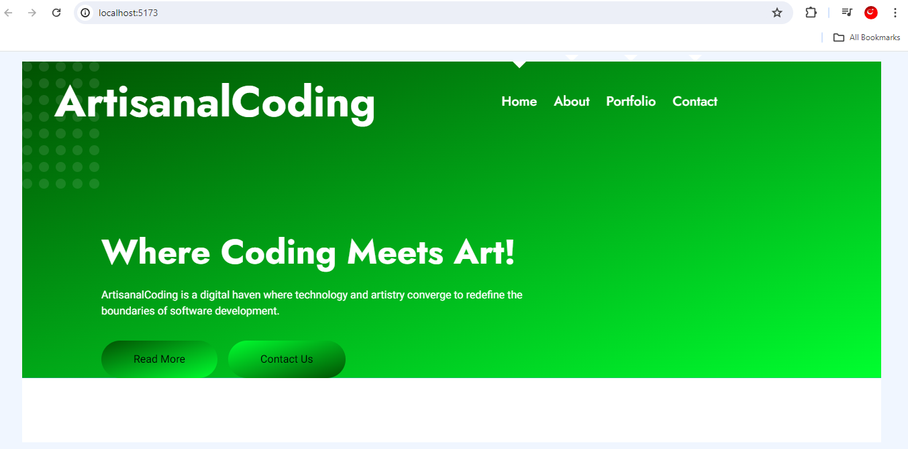
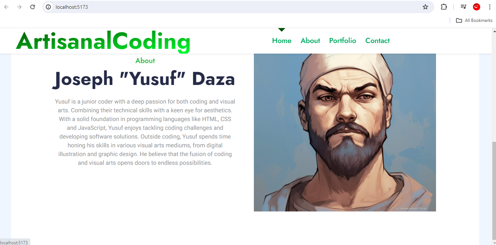
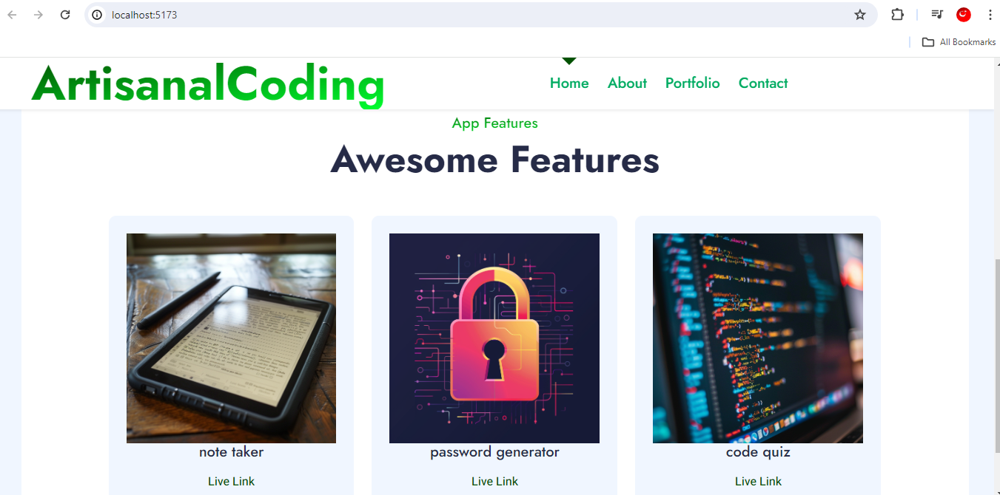

# React Portfolio

## Description

### What was your motivation?
- The motivation behind building this project was to create a user-friendly and visually appealing platform that showcases the developer's skills, projects, and contact information in a structured and accessible manner.

### Why did you build this project?
- I built this project to solve the problem of presenting a developer's portfolio in a professional and organized way, making it easy for visitors to navigate and understand the developer's background, projects, and how to contact them.

### What problem does it solve?
- This project solves the problem of effectively presenting a developer's portfolio, ensuring that visitors can easily navigate through different sections, view projects with links to their deployment and GitHub repositories, contact the developer through a form with validation, and access the developer's resume and profiles on various platforms.

### What did you learn?
- Through this project, I learned about the importance of user experience design in creating effective portfolios, including features such as clear navigation, interactive elements like form validation, and ensuring that the content is easily accessible and well-structured.

## Installation

1. Go to your project directory on your command.
2. Install the necessary dependency such as NPM.
3. Start the development server.
4. Start the application, then open your web browser and navigate to `http://localhost:3000`. 

## Usage

1. Explore the header.
2. Navigate through sections(About Me, Porfolio, Contact, Resume).
3. Explore the portfolio's content, interact with various sections and use the provided links to connect with the developer's work. 

## Screenshot

    

## Features

[Netlify](https://www.netlify.com/)

## MIT License

Copyright (c) 2024 Joseph Daza

Permission is hereby granted, free of charge, to any person obtaining a copy
of this software and associated documentation files (the "Software"), to deal
in the Software without restriction, including without limitation the rights
to use, copy, modify, merge, publish, distribute, sublicense, and/or sell
copies of the Software, and to permit persons to whom the Software is
furnished to do so, subject to the following conditions:

The above copyright notice and this permission notice shall be included in all
copies or substantial portions of the Software.

THE SOFTWARE IS PROVIDED "AS IS", WITHOUT WARRANTY OF ANY KIND, EXPRESS OR
IMPLIED, INCLUDING BUT NOT LIMITED TO THE WARRANTIES OF MERCHANTABILITY,
FITNESS FOR A PARTICULAR PURPOSE AND NONINFRINGEMENT. IN NO EVENT SHALL THE
AUTHORS OR COPYRIGHT HOLDERS BE LIABLE FOR ANY CLAIM, DAMAGES OR OTHER
LIABILITY, WHETHER IN AN ACTION OF CONTRACT, TORT OR OTHERWISE, ARISING FROM,
OUT OF OR IN CONNECTION WITH THE SOFTWARE OR THE USE OR OTHER DEALINGS IN THE
SOFTWARE.

